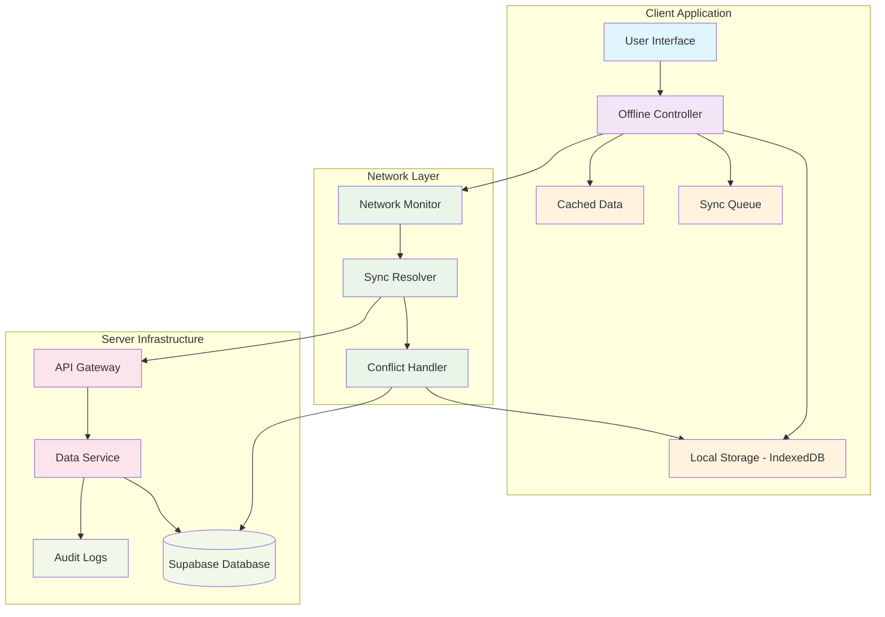

# Offline-First System Architecture

## 1. System Architecture Overview



## 2. Data Flow Patterns

### 2.1 Online Mode
```
User Action → Immediate API Call → Database → Real-time Update → UI Refresh
```

### 2.2 Offline Mode
```
User Action → Local Queue → IndexedDB → UI Optimistic Update → [Wait for Connection]
```

### 2.3 Sync Mode (Connection Restored)
```
IndexedDB Queue → Batch Sync → Conflict Resolution → Database Update → UI Refresh
```

## 3. Implementation Details

### 3.1 Local Storage Architecture

**IndexedDB Structure:**
- **operations**: Queue of pending operations
- **cachedData**: Cached server data for offline access
- **syncMetadata**: Sync timestamps and metadata

**Storage Limits:**
- Maximum queue size: 1,000 operations
- Maximum storage: 100MB
- Automatic cleanup of synced operations older than 7 days

### 3.2 Conflict Resolution Strategy

**Priority Order:**
1. **Server Wins**: For critical data (verification status, official documents)
2. **Last Write Wins**: For user-generated content (profiles, preferences)
3. **Manual Resolution**: For complex conflicts requiring human intervention

**Conflict Detection:**
- Compare timestamps between local and server versions
- Use version numbers or ETags for optimistic locking
- Flag conflicts that require manual resolution

### 3.3 Synchronization Mechanisms

**Automatic Sync Triggers:**
- Connection restored event
- Periodic sync every 30 seconds (when online)
- User-initiated force sync
- App foreground/background events

**Batch Processing:**
- Process operations in batches of 10
- Small delays between batches to prevent server overload
- Retry failed operations with exponential backoff

## 4. User Experience Considerations

### 4.1 Offline Indicators
- **Status Badge**: Always visible indicator showing connection and sync status
- **Form Feedback**: Clear messaging when saving offline vs. submitting online
- **Progress Indicators**: Show sync progress and queue status

### 4.2 Optimistic Updates
- **Immediate Feedback**: UI updates immediately for better user experience
- **Visual Indicators**: Mark offline-created items with special styling
- **Rollback Capability**: Ability to revert optimistic updates if sync fails

### 4.3 Error Handling
- **Graceful Degradation**: Full functionality available offline
- **Clear Messaging**: Inform users about offline status and limitations
- **Recovery Options**: Provide options to retry failed operations

## 5. Testing Strategy

### 5.1 Offline Scenarios
- **Network Interruption**: Test during form submission
- **Extended Offline**: Test with multiple queued operations
- **Storage Limits**: Test behavior when approaching storage limits
- **Conflict Resolution**: Test with simultaneous online/offline changes

### 5.2 Performance Testing
- **Sync Performance**: Measure time to sync various queue sizes
- **Storage Performance**: Test IndexedDB performance with large datasets
- **UI Responsiveness**: Ensure UI remains responsive during sync

### 5.3 Data Integrity Testing
- **Conflict Resolution**: Verify correct handling of data conflicts
- **Queue Persistence**: Ensure queue survives browser restarts
- **Partial Sync**: Test recovery from interrupted sync operations

## 6. Security Considerations

### 6.1 Local Data Protection
- **Encryption**: Sensitive data encrypted in IndexedDB
- **Access Control**: Local data tied to authenticated user session
- **Cleanup**: Automatic cleanup of local data on logout

### 6.2 Sync Security
- **Authentication**: All sync operations require valid JWT
- **Validation**: Server validates all incoming offline operations
- **Audit Trail**: All sync operations logged for security monitoring

## 7. Monitoring & Observability

### 7.1 Metrics
- **Queue Size**: Monitor pending operation counts
- **Sync Success Rate**: Track successful vs. failed sync operations
- **Offline Usage**: Monitor how often users work offline
- **Storage Usage**: Track local storage consumption

### 7.2 Alerts
- **High Queue Size**: Alert when queues exceed thresholds
- **Sync Failures**: Alert on repeated sync failures
- **Storage Limits**: Alert when approaching storage limits

## 8. Future Enhancements

### 8.1 Advanced Features
- **Selective Sync**: Allow users to choose what data to sync
- **Background Sync**: Use Service Workers for background synchronization
- **Peer-to-Peer Sync**: Enable direct sync between devices in same network

### 8.2 Performance Optimizations
- **Delta Sync**: Only sync changed data, not full records
- **Compression**: Compress queued operations to save storage
- **Smart Caching**: Intelligent cache management based on usage patterns